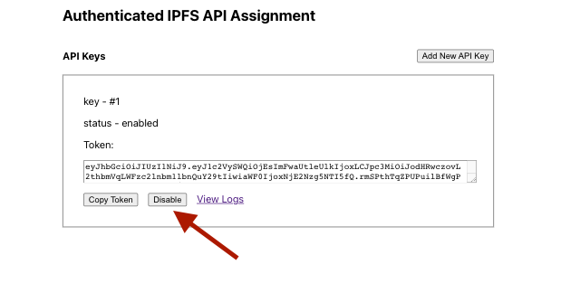
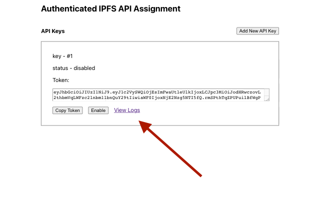

# kanej-assignment

[](https://github.com/RichardLitt/standard-readme)
[](https://github.com/kanej/kanej-assignment/actions/workflows/main.yaml)

> Authenticated proxy for IPFS API

An assignment where the goal is "to secure a public IPFS API with simple API keys (simply by providing a custom HTTP header) and build an app to manage the keys and view logs/metrics".

A copy of the specification is available in the docs folder [here](./docs/Full-Stack-Engineer-Assignment.pdf).

## Table of Contents

- [kanej-assignment](#kanej-assignment)
  - [Table of Contents](#table-of-contents)
  - [Requirements](#requirements)
    - [Assessment criteria](#assessment-criteria)
  - [Plan & Design](#plan--design)
  - [Implementation](#implementation)
  - [Install](#install)
    - [Setup](#setup)
      - [Install code dependencies](#install-code-dependencies)
      - [Run the dependent services](#run-the-dependent-services)
      - [Start Web UI and Server in dev](#start-web-ui-and-server-in-dev)
  - [Usage](#usage)
    - [Add an api key token](#add-an-api-key-token)
    - [Disable an API token](#disable-an-api-token)
    - [View Request logs](#view-request-logs)
  - [Development](#development)
    - [Testing](#testing)
    - [Linting and formatting](#linting-and-formatting)
  - [Maintainers](#maintainers)
  - [License](#license)

## Requirements

* [x] Create a React application with simple email/username + password authentication thatlets you create new or disable existing API keys
* [x] Create a proxy server that handles API Key authentication and forwards request to IPFS API
* [x] When requests are made to the proxy server , we should log them in a db with relation to API key
* [x] Disabling the API key should block the API request when using that key
* [x] Display the requests in the application under each API key that was created
* [x] Provide simple README doc, so we can properly build & run
* [ ] Bonus: for logging metrics (request count, bytes transferred)
* [ ] written question: How would you improve this assignment for a production ready solution (e.g., security,deployment)
* [ ] written question: Describe IPFS and compare it to other protocols e.g., HTTP?

### Assessment criteria

* Completion/functionality - 10 pts (are all the pieces working as described?)
* Code quality - 5 pts (structure, style, package selection, efficiency) 
* Documentation - 5 pts (could be as comments or a quick readme)
* Written questions - 5 pts

## Plan & Design

I have put together an [intended plan and system design](./docs/plan-and-design.md),
including my working assumptions and UI sketches.

## Implementation

The final implementation roughly matched the design doc:


A `create-react-app` frontend (available on http://localhost:3000) talks to a node express.js webserver (available at http://localhost:12800) under a set of '/admin' and '/admin/api' endpoints (**NOTE**: the cra dev server is proxying onto the api webserver, a production deployment might see the static CRA app served from a different server).

The node webserver combines two responsibilities:

1. Providing an admin api that allows adding api keys, listing api keys, listing log requests, toggling api keys enabled.
2. Providing an http proxy to a backing IPFS daemon that enforces authentication through an authorization header on the request.

Authentication is handled by calling the `/admin/signin` endpoint which uses `express cookieSession`, the presence of a valid session cookie is then used to restrict the other `/admin/api` endpoints.

The webserver stores all state in postgres under three tables `users`, `api_keys` and `request_logs`. The schema setup is in the [`./packages/server/sql/setup.sql`](./packages/server/sql/setup.sql) file, but reproduced here for convenience:

```sql
CREATE EXTENSION pgcrypto;

CREATE TABLE users (
  id SERIAL PRIMARY KEY,
  username VARCHAR(64) NOT NULL,
  password VARCHAR(64) NOT NULL,
  UNIQUE(username)
);

CREATE TABLE api_keys (
  id SERIAL PRIMARY KEY,
  user_id INT,
  token VARCHAR(180) NOT NULL,
  enabled BOOLEAN,
  created_at TIMESTAMPTZ NOT NULL DEFAULT NOW(),
  CONSTRAINT fk_user FOREIGN KEY(user_id) REFERENCES users(id)
);

CREATE TABLE request_logs (
  id SERIAL PRIMARY KEY,
  api_key_id INT,
  url TEXT,
  created_at TIMESTAMPTZ NOT NULL DEFAULT NOW(),
  CONSTRAINT fk_user FOREIGN KEY(api_key_id) REFERENCES api_keys(id)
);

INSERT INTO users (username, password) VALUES (
  'fleekadmin',
  crypt('dwebforthewin', gen_salt('bf'))
);
```

There is no `add user` functionality in this implementation, the only user is the hardcoded `fleekadmin` user with the password `dwebforthewin`. The schema and test user are auto-applied to the database on `docker-compose up`.

The tokens that are used for authorizing http requests to the IPFS api, are generated when the API Key is generated and stored in the `api_key` record. The token is a JWT and captures the api key id.

## Install

This is a node.js based project that uses docker to run local services (e.g. ipfs and postgres).

The repo is structured into two parts:

* web ui (CRA website package) available under `./packages/web`
* node express.js server available under `./packages/server`

### Setup

#### Install code dependencies

To install the node dependencies, run `yarn` from the root of the repository:

```sh
yarn
```

This should invoke `yarn` in each of the subpackages (i.e. `./packages/web`, `./packages/server`).

#### Run the dependent services

The next step is to run the supporting services (ipfs daemon and postgres). I have encapsulated both in a [docker-compose file](./docker-compose.yaml). Run `docker-compose` from the repo root to start the services:

```
docker-compose up
```

You should now have an `ipfs` daemon running with api exposed on http://127.0.0.1:5001); and a postgres server (available on port `5432`) and `adminer` a web ui for interacting with postgres (http://localhost:9080).

You can test the IPFS daemon api endpoint with curl:

```sh
curl -X POST http://127.0.0.1:5001/api/v0/swarm/addrs
```

This should always work as it bypasses the authenticated proxy.

Postgres creates an `assignment` database that is initialised with the schema and test data in `./packages/server/sql/setup.sql`. This includes a test admin user:

```json
{
  "username": "fleekadmin",
  "password": "dwebforthewin"
}
```

Adminer, the postgres web ui is available at http://localhost:9080, the login details are those of the postgres server that are set in the docker-compose file:

```yaml
  POSTGRES_USER: fleek
  POSTGRES_PASSWORD: fleek-password
  POSTGRES_DB: assignment
```


#### Start Web UI and Server in dev

To run the react ui and backend node server in development mode:

```sh
yarn start
```

This invokes `yarn start:web` and `yarn start:server` concurrently, but they can be run separately.

The front end UI website should be available at http://localhost:3000.

The webserver should now be available at http://localhost:12800.

## Usage

You can test proxying onto the IFPS api with curl:

```sh
curl -X POST http://127.0.0.1:12800/api/v0/swarm/addrs
```

This should return `403 forbidden`, as no authorization header has been passed.

### Add an api key token

To add an api key token, first we browse to http://localhost:3000 and  with login the fleek admin user, username `fleekadmin` and password `dwebforthewin`:


You should now see the dashboard for the `fleekadmin` user and that there are no keys, but you can add one with the `Add New API Key` button:


The added key will be have an id (e.g. #1), a status of either enabled or disabled and a token which we can use for making api calls.

Copy the token with the `Copy Token` button:


You can now use that token to make IPFS API requests by passing the token as an authorization header:

```sh
curl -H "Authorization: bearer <COPIED-TOKEN>" -X POST http://127.0.0.1:12800/api/v0/swarm/addrs

# { "Addrs: {...} }

```

### Disable an API token

While logged in and on the dashboard page you can disable an api key with the `Disable` button (and similarly renable it):



Curling with that token should now return forbidden until it is re-enabled:

```sh
curl -H "Authorization: bearer <DISABLED-TOKEN>" -X POST http://127.0.0.1:12800/api/v0/swarm/addrs

# Forbidden
```

### View Request logs

You can view an api keys request logs with the `View logs` link:



This will show the requests that have been made with an api key (currently no more than the url and timestamp, but `method`, `body`, `number of bytes` and more could all be added).


## Development

### Testing

Unit testing fell by the wayside pretty early on server side and wasn't attempted for the react app, but if you want you can run:

```
yarn test
```

### Linting and formatting

To lint the two packages with `eslint`:

```
yarn lint
```

The code layout is enforced by `prettier`:

```
yarn format
```

## Maintainers

[@kanej](https://github.com/kanej)

## License

MIT © 2021 John Kane
