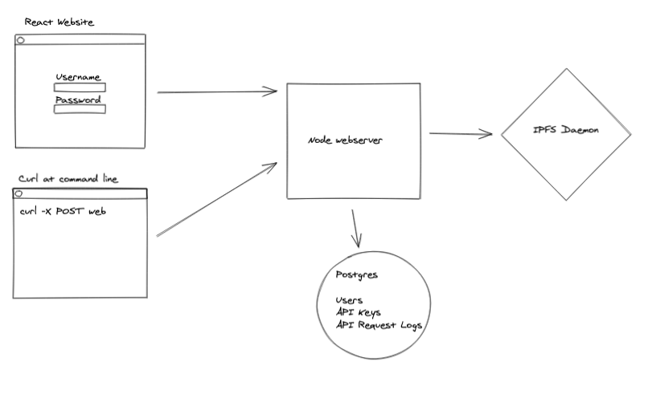

# Plan and Design

Always a good idea to have a rough plan.

## Assumptions

* It is only the IPFS API endpoint that is being secured with authentication, not the web endpoint.
* This is a coding challenge and so writing some code is involved, finding the right nginx plugin would be against the spirit.
* The web ui includes email/password sign in, but does not mention a user registration flow, I am going to assume no registration flow is required and a hard-coded user and password (for the fleek admin) is acceptable.
* Requests are to be logged to a 'db' for later viewing by the fleek admin, by db I am going to assume a relational database rather than just redis with persistence, or off to an elasticsearch cluster. This assumption is based on the assignments scale and the request for a db rather than a store.
* Only authorised requests are logged.

## Design

Based on the requirements and my assumptions I intend to build:

* A node webserver
  * that allows proxying onto an IPFS daemon with a header containing a valid api key (that has not been disabled)
  * that allows a react website to authenticate, list api keys and list requests logs
* A react (create-react-app) website to:
  * do the client-side part of authenticate
  * list the api keys
  * allow disabling of an api key
  * display the requests that have come in against an api key

From the requirements a potential website design would be:

## Plan

* Setup web server api
* Configure proxying
* Setup postgres with hardcoded user
* Limit proxying to requests with headers with a valid api key
* Record requests as logs in postgres
* Setup create-react-app website
* Create sign in page
* Create api key listing page
* Create api key details page
* Document setup
* Written questions
